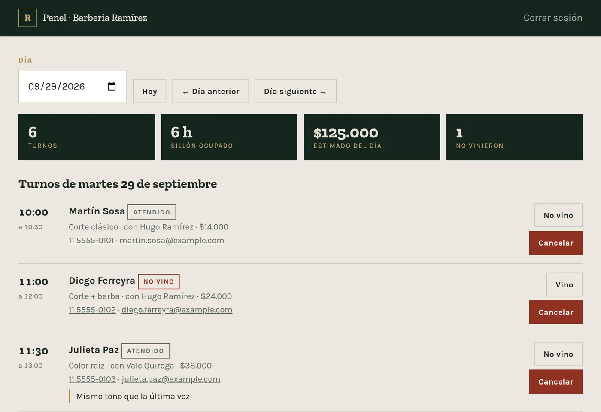

# Sistema de turnos — Barbería Ramírez

> **English summary.** Booking system for a (fictional) barbershop: Node.js + Express + PostgreSQL, no framework on the front end.
> Per-barber availability, real service durations, a cancel link per booking (no customer accounts), and an owner dashboard with daily appointments and a 15-day no-show rate.
> The double-booking rule lives in the database as a PostgreSQL **exclusion constraint** (see section 3), so even a bug in the application code can't store two overlapping appointments for the same barber.
> **Tests:** 22 pure unit tests (availability and validation logic, no database) and 20 integration tests against a real PostgreSQL, including two simultaneous requests for the same slot where exactly one must win.
> The public demo runs with `MODO_DEMO=1` and without SMTP: no real emails are sent, and the confirmation screen shows the same manage/cancel link the email would contain.
> Docs are in Spanish (Rioplatense), the language of the target clients.



**Construido:** 04/08/2026 · Node.js + Express + PostgreSQL
Es el escalón siguiente al Paquete 2 (Apps Script sobre Fuerza Sur): backend propio, base de datos propia, panel de administración.

---

## 1. Qué hace

- Reserva pública en 4 pasos: servicio → profesional → día y hora → datos.
- **Disponibilidad por persona**, no por local. Que Hugo esté ocupado a las 11 no ocupa a Nico.
- **Duración real por servicio**: una barba de 30 min y un balayage de 120 min no ocupan lo mismo, y el sistema solo ofrece huecos donde entra el servicio completo antes de cerrar.
- **Imposible reservar dos veces el mismo hueco**, incluso con dos pedidos en el mismo milisegundo (ver punto 3).
- Mail de confirmación al cliente + aviso al dueño, con link para cancelar sin crearse una cuenta.
- Panel del dueño: turnos del día, marcar "vino" / "no vino", cancelar, cerrar ratos de la agenda, y la tasa de ausentismo de los últimos 15 días.
- Sin pagos ni señas. Es a propósito, no un olvido: manejar plata de terceros es otro nivel de responsabilidad y va cuando el resto esté probado con un cliente real.

## 2. Cómo está armado

```
turnos/
├── src/
│   ├── config.js          ← TODO lo que cambiaría un dueño: horarios, precios, servicios, equipo
│   ├── schema.sql         ← las tablas. Lo importante está al final
│   ├── disponibilidad.js  ← cálculo de huecos (lógica pura, sin base ni fechas)
│   ├── validacion.js      ← validación del lado del servidor (lógica pura)
│   ├── reservas.js        ← disponibilidad y creación de turnos
│   ├── panel.js           ← consultas del panel del dueño
│   ├── auth.js            ← login del panel (bcrypt + sesión en la base)
│   ├── mailer.js          ← mails (funciona sin SMTP: los imprime en consola)
│   ├── db.js  env.js  migrar.js  sembrar.js  server.js
├── public/                ← lo que ve el navegador. Sin una sola credencial adentro
│   ├── index.html (reservar) · turno.html (ver/cancelar) · admin.html (panel)
└── test/
    ├── logica.test.js     ← 22 pruebas, corren sin base de datos ni internet
    └── integracion.test.js← 20 pruebas, necesitan un Postgres de verdad
```

## 3. La pieza que justifica todo el diseño

En el Paquete 2 el candado contra la doble reserva era `LockService`: **yo** me paraba en la puerta y decía "pará, hay uno adentro". Funciona, pero depende de que mi código se acuerde de poner el candado en todos los caminos posibles.

Acá la regla vive dentro de la base de datos:

```sql
CONSTRAINT turnos_sin_solape EXCLUDE USING gist (
  barbero_id WITH =,
  franja     WITH &&
) WHERE (estado <> 'cancelado')
```

**Formal:** una *exclusion constraint* con índice GiST. Postgres rechaza cualquier fila donde exista otra con el mismo `barbero_id` y una `tstzrange` que se solape. Dos transacciones concurrentes se serializan en el índice; la perdedora recibe el SQLSTATE `23P01` (`exclusion_violation`).

**En criollo:** el `LockService` era yo cuidando la puerta. Esto es que el sillón físicamente no acepte dos personas sentadas. **Aunque el código de arriba tenga un bug, la doble reserva no se puede guardar.** No hay ventana entre "fijate si está libre" y "guardalo": la base decide las dos cosas en la misma operación.

Es también el mejor argumento de entrevista de todo el proyecto: cualquiera hace un CRUD; poder explicar por qué la regla de integridad va en el dato y no en la aplicación es otra conversación.

## 4. Lecciones del Paquete 2 que se trasladaron

| Lección de `02_AUTOMATIZACION_DE_RESERVAS.md` | Cómo se aplicó acá |
|---|---|
| Bloqueo atómico (`LockService`) | `EXCLUDE constraint` de Postgres — mismo problema, herramienta más fuerte |
| Validar todo del lado del servidor | `validacion.js`, más los `CHECK` de la tabla, más la verificación de horario en `crearTurno` |
| Nunca `new Date('2026-08-05')` | **Ni una sola conversión de fecha en JavaScript.** La hace Postgres con `AT TIME ZONE 'America/Argentina/Buenos_Aires'` |
| Teléfono como texto, no como número | Columna `text` con `CHECK`, y el `011` sobrevive |
| No leer la tabla entera en cada reserva | El anti-doble-clic mira solo los últimos 120 segundos, con índice |
| Guardar primero, mandar mails después | El turno se guarda en la transacción; los mails salen después, cada uno en su `try` |
| Cero credenciales en el JS del navegador | El frontend solo conoce rutas `/api/...`. `DATABASE_URL` y SMTP viven en variables de entorno |
| Probar la lógica antes de tocar datos reales | 22 pruebas puras que corren sin base, más 20 de integración contra un Postgres real (pasaron todas el 29/09/2026, en PostgreSQL 16, en una base descartable) |
| Configuración arriba de todo, en un bloque | `src/config.js` |

## 5. Poner esto a andar

Guía paso a paso en **[`README_DEPLOY.md`](README_DEPLOY.md)**. Resumen: crear base en Neon → `npm install` → `npm run migrar` → `npm run sembrar` → `npm start`.

**Modo demo** (`MODO_DEMO=1`): las páginas públicas muestran un aviso de "negocio ficticio". Si además no hay SMTP configurado, la confirmación no promete un mail: avisa que el demo no manda mails y ofrece el link de gestión en pantalla. Con un cliente real se saca `MODO_DEMO` y se cargan los datos de `NEGOCIO` en `src/config.js`.

## 6. Lo que NO tiene, y por qué

- **Pagos / señas.** La seña baja el ausentismo 40-60% y es la mejora más rentable, pero implica manejar plata de terceros. Va en v2, con un cliente real.
- **WhatsApp.** Reduce el ausentismo más que el mail, pero la API oficial cobra por conversación. Investigado en `06_PAQUETES_Y_AUTOMATIZACION.md`; se evalúa cuando haya un cliente que lo pague.
- **Recordatorio 48hs y 2hs antes.** Hoy solo hay confirmación al reservar. Falta una tarea programada (un cron) que barra los turnos del día siguiente. Es lo más barato de agregar y lo que más baja el ausentismo — primer candidato para la v1.1.
- **Reprogramar en un clic.** Hoy son dos pasos: cancelar y sacar otro.
- **Multi-sede, multi-idioma, roles de usuario.** Fuera de alcance a propósito (`09_SISTEMA_DE_TURNOS.md`, sección 5).
